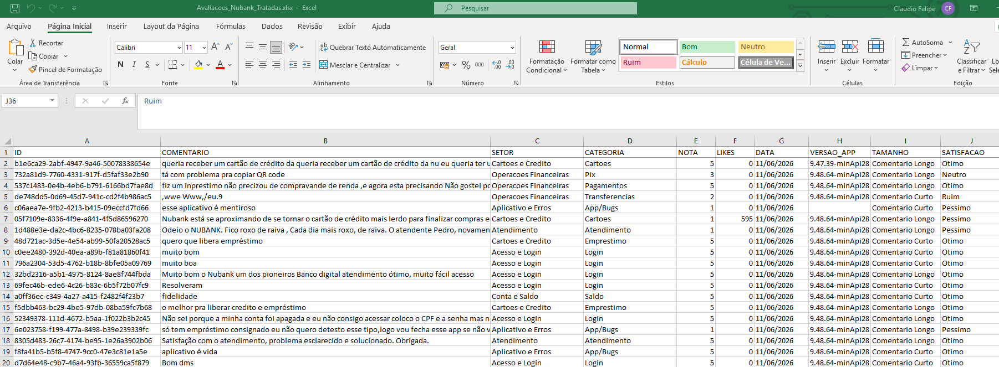
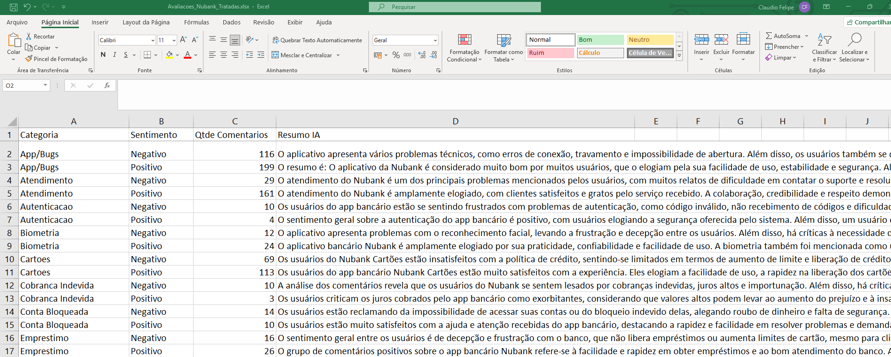
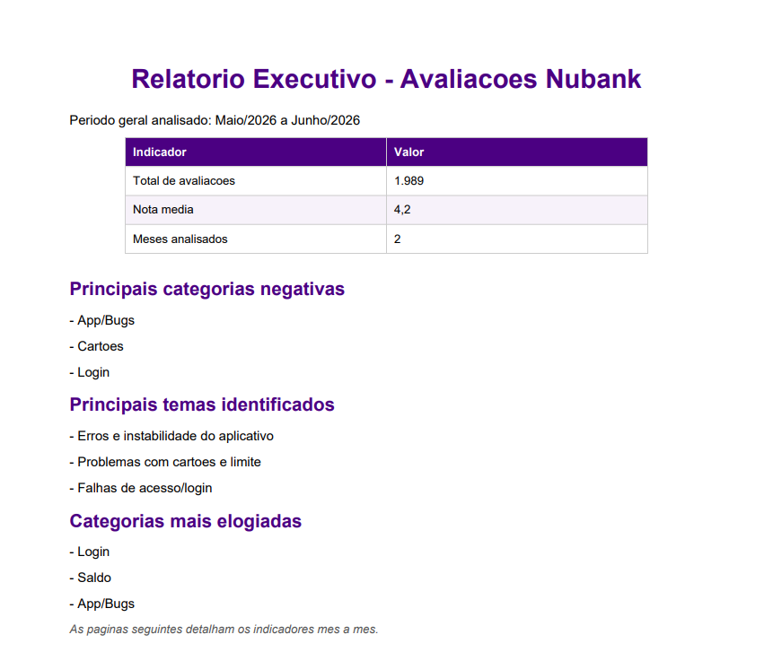

# Automação de avaliações da Nubank com IA, regras e similaridade
---

## Sobre o Projeto 

Este projeto apresenta uma análise automatizada de avaliações públicas do aplicativo Nubank na Play Store. A proposta é transformar comentários de usuários em informações organizadas, classificadas e resumidas, apoiando a identificação de problemas recorrentes, elogios, categorias críticas e oportunidades de melhoria no aplicativo. O sistema coleta avaliações reais da Play Store, trata os dados, classifica cada comentário em setores e categorias, gera uma planilha analítica em Excel com reusmo dos comentarios feito por IA e cria também um relatório executivo em PDF com indicadores mensais. A ideia central do projeto é aplicar inteligência artificial de forma prática em um processo de análise de feedbacks, combinando regras de negócio, similaridade textual e IA para lidar com comentários mais ambíguos.

## Objetivo 
Criar um pipeline em Python capaz de coletar, tratar, classificar e resumir avaliações de usuários da Play Store, transformando comentários soltos em uma base estruturada para análise. O projeto foi desenvolvido para:

✅ Coletar avaliações públicas do app Nubank na Play Store     
✅ Limpar e organizar os comentários coletados     
✅ Classificar cada comentário por setor e categoria      
✅ Separar avaliações positivas e negativas     
✅ Usar IA local em casos ambíguos ou mais complexos     
✅ Gerar resumos automáticos por categoria e sentimento com IA local     
✅ Exportar uma planilha analítica em Excel       
✅ Criar um relatório executivo em PDF com indicadores mensais      

## Tecnologias Utilizadas 

- Python
- Pandas
- Google Play Scraper
- OpenPyXL
- ReportLab
- Ollama
- Llama 3
- Excel
- PDF

## Coleta das Avaliações 

A coleta é feita a partir das avaliações públicas disponíveis na Play Store, utilizando a biblioteca `google-play-scraper`.

No código, essa etapa acontece no arquivo `avaliacoes.py`, dentro da função `coletar_avaliacoes()`.

O app analisado é identificado pelo pacote:

```text
com.nu.production
```

Esse é o identificador público do aplicativo Nubank na Play Store.

Durante a coleta, o sistema busca avaliações em português do Brasil e utiliza paginação para trazer os comentários em lotes. O objetivo configurado no projeto é coletar aproximadamente 2 mil avaliações.

Como a Play Store pode retornar uma quantidade ligeiramente menor dependendo da disponibilidade e da paginação, o número final pode variar um pouco. Por isso, o projeto trabalha com a ideia de aproximadamente 2 mil avaliações públicas.

## Tratamento dos Dados 

Após a coleta, os dados são transformados em uma tabela com as principais informações:

- ID da avaliação
- Comentário
- Nota
- Quantidade de likes
- Data
- Versão do app

Também são criadas colunas auxiliares para facilitar a análise:

- `TAMANHO`: identifica se o comentário é curto ou longo
- `SATISFACAO`: traduz a nota em uma descrição como Péssimo, Ruim, Neutro, Bom ou Ótimo

Comentários vazios são removidos, pois não trazem conteúdo suficiente para classificação ou análise textual.

## Classificação dos Comentários

Cada comentário é classificado em um setor e uma categoria.

O projeto utiliza 7 setores principais:

- Acesso e Login
- Cartões e Crédito
- Operações Financeiras
- Conta e Saldo
- Aplicativo e Erros
- Atendimento
- Cobrança

E 15 categorias:

- Login
- Senha
- Autenticação
- Conta Bloqueada
- Biometria
- Cartões
- Empréstimo
- Pix
- Transferências
- Pagamentos
- Saldo
- Extrato
- App/Bugs
- Atendimento
- Cobrança Indevida

Essa classificação permite transformar comentários livres em uma estrutura analítica. Em vez de analisar apenas textos soltos, é possível contar quantos comentários falam sobre Pix, Login, Atendimento, Cartões e outros temas importantes.

## Abordagem Híbrida de Classificação

A classificação não depende apenas da IA.

O sistema usa uma abordagem híbrida:

```text
Regras de palavras-chave
+ Similaridade textual
+ Validações de domínio
+ IA local em casos ambíguos
```

Essa decisão foi tomada porque muitos comentários têm sinais claros.

Por exemplo:

- Se o comentário fala em "senha", provavelmente está relacionado à categoria Senha
- Se fala em "Pix", provavelmente está relacionado à categoria Pix
- Se fala em "chat" ou "atendente", provavelmente está relacionado a Atendimento

Nesses casos, regras simples são mais rápidas, explicáveis e confiáveis.

A IA entra principalmente quando o comentário é mais ambíguo, mistura vários assuntos ou apresenta baixa confiança na classificação por regras.

Esse formato evita usar IA de forma desnecessária, mas mantém a inteligência artificial como apoio em situações onde ela agrega valor.

## Uso da Inteligência Artificial

A IA é utilizada em dois momentos principais.

### 1. Validação de casos ambíguos

Quando o comentário apresenta sinais misturados ou baixa confiança, o sistema consulta o modelo local via Ollama.

O modelo usado no projeto é:

```text
llama3:latest
```

A IA recebe uma lista fechada de categorias candidatas e precisa escolher uma delas. Isso reduz o risco de respostas inventadas e mantém o resultado dentro da taxonomia do projeto.

### 2. Geração de resumos por categoria

Depois que os comentários são classificados, a IA gera resumos automáticos agrupando os textos por:

- Categoria
- Sentimento

As notas são agrupadas da seguinte forma:

- Notas 1, 2 e 3: Negativo
- Notas 4 e 5: Positivo

## Arquivos Gerados

### Planilha Excel

O arquivo `Avaliacoes_Nubank_Tratadas.xlsx` possui duas abas.

#### Aba `comentarios`

Contém a base tratada, com cada comentário classificado.



#### Aba `resumos_ia`

Contém os resumos gerados pela IA por categoria e sentimento.



### Relatório Executivo em PDF

O arquivo `Relatorio_Executivo_Nubank.pdf` apresenta uma visão mais simples e executiva dos dados, criado para facilitar a leitura de quem não precisa navegar pela planilha completa, mas quer entender rapidamente os principais pontos encontrados..

Ele traz:

- Período analisado
- Total de avaliações
- Nota média
- Distribuição das notas
- Principais categorias negativas
- Principais temas identificados
- Categorias mais elogiadas
- Indicadores separados por mês



## Estrutura dos Arquivos

```text
avaliacoes.py
```

Arquivo principal do projeto. Ele executa o fluxo completo:

- coleta avaliações
- monta a base tratada
- classifica comentários
- gera Excel
- gera PDF

```text
classificacao_ia.py
```

Contém a lógica de classificação:

- setores e categorias
- regras de palavras-chave
- similaridade textual
- validações de domínio
- integração com Ollama
- geração de resumos com IA

```text
relatorio_pdf.py
```

Responsável pela criação do relatório executivo em PDF.

```text
requirements.txt
```

Lista as bibliotecas necessárias para executar o projeto.

## Principais Benefícios

### Organização de feedbacks em grande volume

Comentários de usuários costumam ser difíceis de analisar manualmente, principalmente quando existem centenas ou milhares de avaliações.

Este projeto organiza os textos em categorias claras, permitindo entender rapidamente quais problemas aparecem com mais frequência.

### Classificação explicável

A classificação usa regras e similaridade textual antes de chamar a IA. Isso torna o processo mais controlado e fácil de explicar.

### Uso prático da IA

A IA não é usada apenas como enfeite. Ela entra para apoiar casos ambíguos e gerar resumos executivos a partir dos comentários classificados.

### Entrega analítica completa

O projeto entrega tanto uma base detalhada em Excel quanto um relatório executivo em PDF, atendendo públicos diferentes:

- analistas podem explorar a planilha
- gestores podem ler o relatório resumido

## Possíveis Aplicações

Embora o projeto tenha sido aplicado às avaliações do Nubank, a mesma lógica pode ser adaptada para outros contextos:

- avaliações de outros aplicativos
- reclamações de clientes
- chamados de suporte
- pesquisas de satisfação
- comentários em e-commerce
- feedbacks de redes sociais

O ponto principal é transformar texto livre em informação estruturada para tomada de decisão.

## Conclusão

O projeto mostra como a combinação de Python, regras de negócio, similaridade textual e inteligência artificial pode transformar avaliações públicas em insights úteis.

Mais do que apenas classificar comentários, o sistema cria um fluxo completo de análise: coleta, tratamento, categorização, resumo e relatório executivo.

Essa abordagem permite identificar problemas recorrentes, reconhecer pontos positivos e apoiar melhorias no produto ou no atendimento ao cliente.

